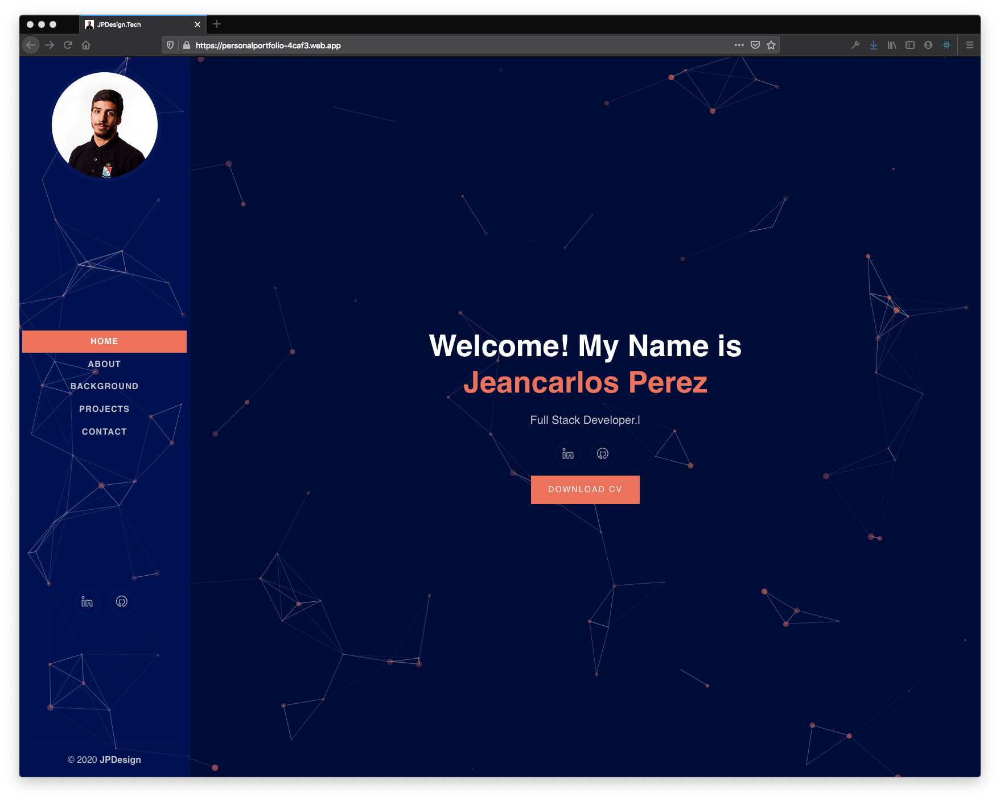

# JPDesign - My Personal Portfolio

This is a repo for my Personal Portfolio - JPDesign.tech

  

## Table of contents

- [About](#about)
- [Portfolio Preview](#portfolio-preview)
- [Skills Used](#skills-used)
- [Course Certification](#udemy-certification)
- [Setup](#setup)
- [Sources & References](#sources-&-references)
- [Scripts](#Scripts,-APIs-&-More)

## Udemy Course:

## About:

This is a portfolio I worked on and built using React, Firebase, and SASS.

## Portfolio Preview

  

## Skills & Tools Used:

## Setup:

1. Run `npm install`
2. Run `npm run dev`
3. Open Localhost:3000

## Sources & References:

### Media:

- Icons: https://icons8.com
- Photos: https://pexels.com
- Fonts & More: https://fontawesome.com

### Scripts, APIs & More:
